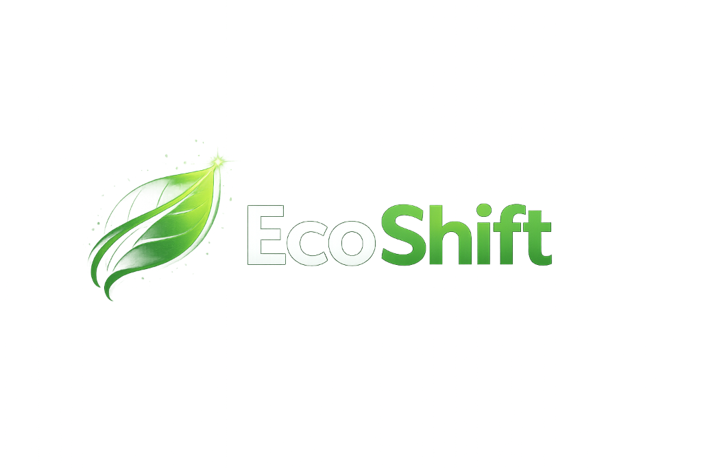
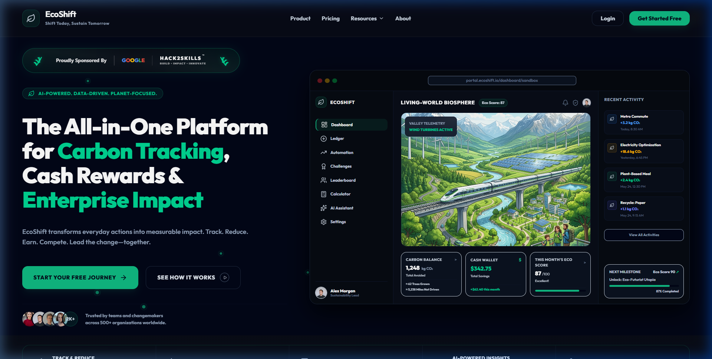
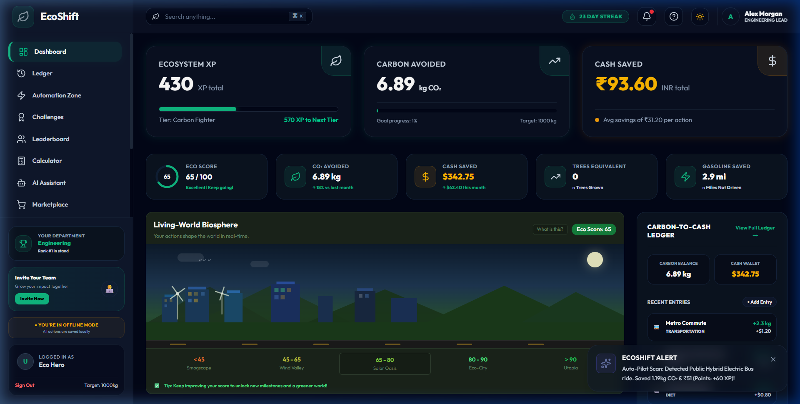

# 🌿 EcoShift

<div align="center">



# **EcoShift**
### **Gamified B2B & B2C Enterprise Sustainability & Carbon Ledger**
*Aligning corporate green initiatives with real-time personal accountability.*

<br/>

[](https://reactjs.org/)
[](https://www.typescriptlang.org/)
[](https://tailwindcss.com/)
[](https://vitejs.dev/)
[](https://firebase.google.com/)
[](https://ai.google.dev/)

</div>

---

## 🌟 Visual Preview

### 🏡 Beautiful Landing Page
Streamlined B2B marketing dashboard preview, highlighting core stats and enterprise carbon tracking.


### 📊 Gamified Employee Dashboard & Living-World Biosphere
Employee visual workbench detailing Ecosystem XP, personal carbon avoidances, utility bill audits, smart home controls, and the real-time biosphere.


---

## 📖 Deep-Dive Architecture & Features

EcoShift bridges the gap between individual environmental action and corporate environmental social governance (ESG) targets. The system compiles habits, commutes, and domestic energy consumption into verifiable carbon points.

### 🌍 1. The Living-World Biosphere Simulator
A high-fidelity Canvas/SVG simulation that acts as the user's ecological mirror. The scene state compiles values from your daily carbon ledger:

*   **Sky Interpolation:** The background sky gradient transitions dynamically based on the user's score using an active interpolation algorithm:
    ```typescript
    // Helper to interpolate between two hex colors based on user progress factor
    const interpolateColor = (color1: string, color2: string, factor: number) => {
      const c1 = parseHex(color1);
      const c2 = parseHex(color2);
      const r = Math.round(c1.r + factor * (c2.r - c1.r));
      const g = Math.round(c1.g + factor * (c2.g - c1.g));
      const b = Math.round(c1.b + factor * (c2.b - c1.b));
      return `rgb(${r}, ${g}, ${b})`;
    };
    ```
*   **Active Windmills:** Speed up rotation and glow brighter when the user activates clean energy sources in their Commute or Home Automation settings.
*   **Eco-Bullet Train:** A high-speed electric train (`.train-wrapper`) floats onto tracks and runs across the scene once the user reaches the **Solar Oasis** milestone (>65 score), reflecting carbon-neutral transit.
*   **Responsive Vegetation:** Growing tree counts correspond directly to the total avoided CO₂ logged in the ledger.

---

### 🏢 2. B2B Department Networks & Firestore sync
Employees join localized department teams (e.g., *Engineering, Product, Marketing*). Action outcomes are pushed atomically to centralized scoreboard references:

*   **Firestore Aggregations:** Daily carbon-saving logs trigger transaction-safe database writes to update collective department leaderboards.
*   **Leaderboard Logic:**
    ```typescript
    const logActionToDepartment = async (deptId: string, carbonSaved: number, points: number) => {
      const deptRef = doc(db, "departments", deptId);
      await setDoc(deptRef, {
        totalCarbonSaved: increment(carbonSaved),
        totalPoints: increment(points),
        activeMembers: increment(1)
      }, { merge: true });
    };
    ```
*   **Offline Mode:** If Firebase credentials are not configured or the network drops, EcoShift triggers a seamless local state fallback so users never lose their logged actions.

---

### 💳 3. Double-Entry Carbon-to-Cash Ledger
Tracks specific activities under a structured carbon taxonomy, automatically calculating carbon offset value and cash savings:

| Action Category | Metric logged | Avoided Carbon (kg CO₂) | Estimated Cash Saved (INR) |
|---|---|---|---|
| **Clean Commute** | Electric Vehicle vs Petrol | `1.19 kg` saved per mile | `₹60` fuel cost avoided |
| **Dietary Shift** | Plant-Based vs Meat Meal | `2.40 kg` saved per meal | `₹35` resource savings |
| **Recycling Log** | Paper, Plastic, Metals | `0.15 kg` per kg recycled | `₹5` material returns |
| **Clean Energy** | Solar Grid Switch | `18.60 kg` per day offset | `₹120` utility savings |

---

### 🔌 4. Smart Home Automation & Utility OCR Auditor
*   **IoT Simulator:** Empowers users to test temperature offsets, smart bulb automation, and battery load balance.
*   **OCR Bill Auditor:** An intelligent parser. Drag and drop utility bills to scan energy metrics (kWh, Therms), extract historical data, and run carbon projection curves alongside clean energy solar plans.
    

---

## ⚡ Setup & Installation

### Prerequisites
*   [Node.js](https://nodejs.org/) (v18.x or newer)
*   [npm](https://www.npmjs.com/) (v9.x or newer)
*   A Google Gemini API key (for the AI Chatbot Assistant)
*   A Firebase web app project (optional for remote database sync)

### 1. Repository Setup
Clone and enter the directory:
```bash
git clone https://github.com/shresth16k/Ecoshift.git
cd Ecoshift
```

### 2. Dependency Installation
Install project modules:
```bash
npm install
```

### 3. Environment Settings
Create a `.env` file in the root folder:
```env
VITE_GEMINI_API_KEY=your_gemini_api_key_here

# Firebase configuration parameters (optional - drops to local storage fallback if empty)
VITE_FIREBASE_API_KEY=your_api_key
VITE_FIREBASE_AUTH_DOMAIN=your_auth_domain
VITE_FIREBASE_PROJECT_ID=your_project_id
VITE_FIREBASE_STORAGE_BUCKET=your_storage_bucket
VITE_FIREBASE_MESSAGING_SENDER_ID=your_sender_id
VITE_FIREBASE_APP_ID=your_app_id
```

### 4. Running the Dev Server
Launch local instance with Hot Module Replacement (HMR):
```bash
npm run dev
```
Open [http://localhost:5173](http://localhost:5173) in your browser.

### 5. Production Compilation
Build and optimize static assets for deployment:
```bash
npm run build
```
Preview the built package:
```bash
npm run preview
```

---

## 📁 Codebase Layout

```
src/
├── App.tsx             # Application core shell (routing, state context, landing, modules)
├── components/
│   └── LivingWorldSimulator.tsx # Extracted biosphere simulation component
├── index.css           # Design token classes, theme layouts, and keyframe animations
├── main.tsx            # Entry mount point
├── utils/
│   ├── carbonUtils.ts   # Shared carbon math utility functions & simulated state logic
│   └── carbonUtils.test.ts # Vitest automated unit and integration tests
└── vite-env.d.ts       # Global TypeScript typing definitions
```

---

## 🌍 Hackathon Vision
EcoShift demonstrates how **clean code leads to a cleaner planet**. Through interactive gaming elements, real-time feedback loops, and B2B leaderboards, we transform abstract metrics like "metric tons of CO₂" into understandable milestones like "growing a forest" or "unlocking a clean bullet train".
